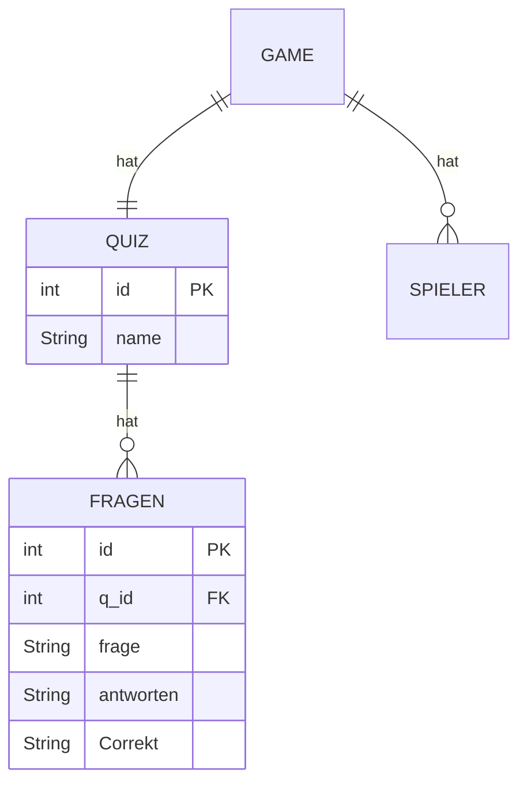

### Datenbank
- Typen
	- Mongodb
	- SQL
- Struktur
	- Haupt Table mit Verlinkung zu fragen
		- ID
		- Name
		- Verlinkung
	- Pro Fragenset ein table
		- ID
		- Frage
		- Antworten seperiert von | 
		- Richtig seperiert von |

