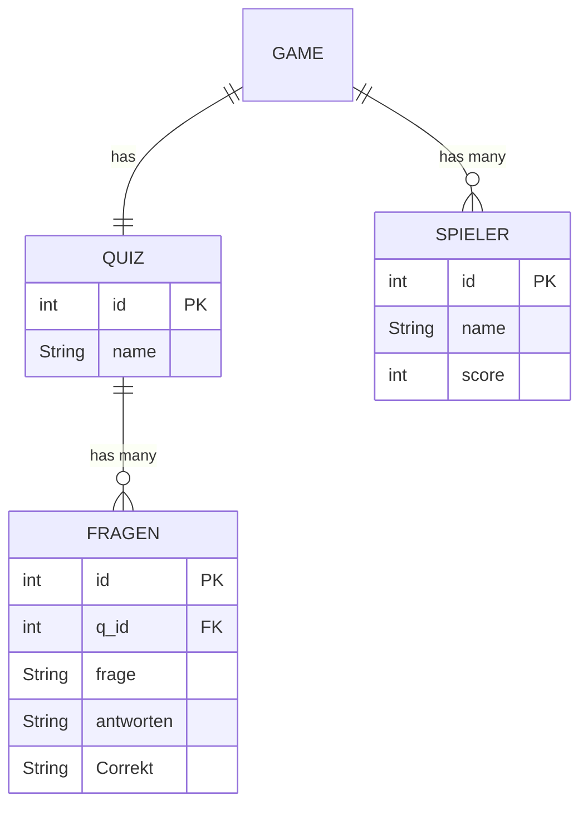

## Struktur

```mermaid
erDiagram
	GAME {
	}
	
	QUIZ {
		int id PK
		String name
	}
	
	FRAGEN {
		int id PK
		int q_id FK
		String frage
		String antworten
		String Correkt
	}
	
	SPIELER {
		int id PK
		String name
		int score
	}
	
	GAME ||--|| QUIZ : "has"
	GAME ||--o{ SPIELER : "has many"
	QUIZ ||--o{ FRAGEN : "has many"
```

