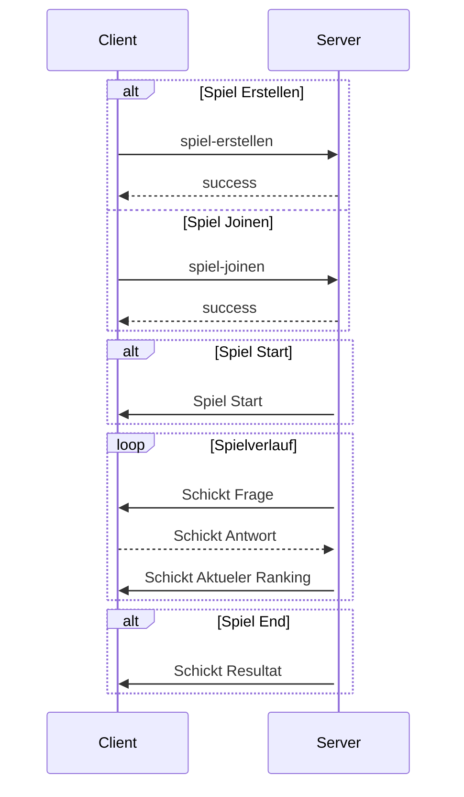

## Struktur

```mermaid
sequenceDiagram
	participant Client
	participant Server
	
	alt Spiel Erstellen
		Client->>Server: spiel-erstellen
		Server-->>Client: success
	else Spiel Joinen
		Client->>Server: spiel-joinen
		Server-->>Client: success
	end
	activate Server
	
	alt Spiel Start
		Server->>Client: Spiel Start
	end
	
	loop Spielverlauf
		Server->>Client: Schickt Frage
		Client-->>Server: Schickt Antwort
		Server->>Client: Schickt Aktueler Ranking
	end
	
	alt Spiel End
		Server->>Client: Schickt Resultat
	end
```
