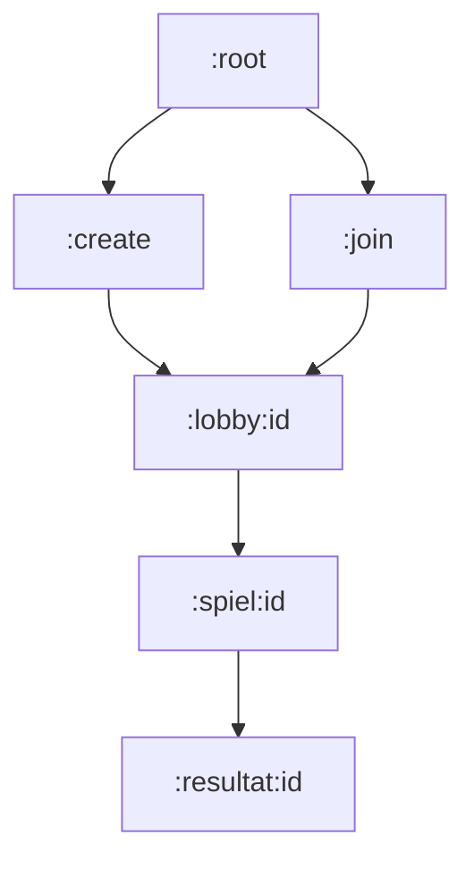

### Webseiten Strukture

```mermaid
graph TD
	root[:root]
	create[:create]
	join[:join]
	lobby[:lobby:id]
	spiel[:spiel:id]
	result[:resultat:id]
	
	root --> create
	root --> join
	create --> lobby
	join --> lobby
	lobby --> spiel
	spiel --> result
```
